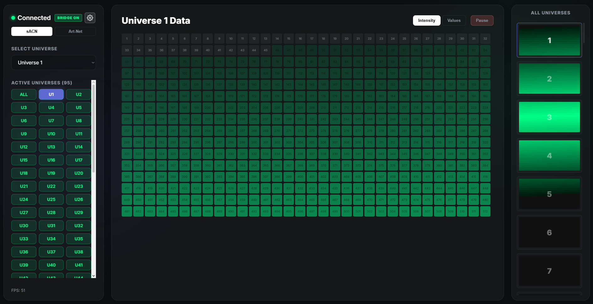
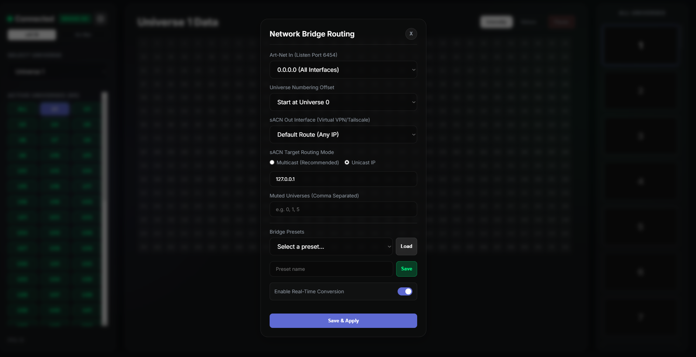
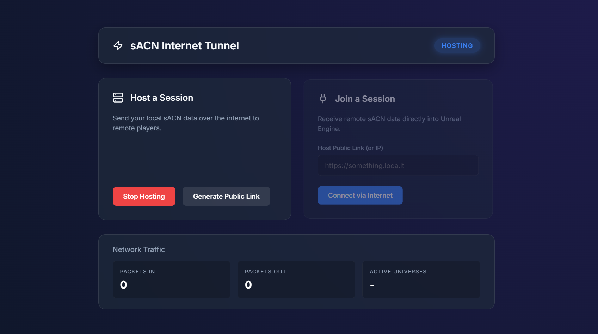

# DMX & sACN Web Visualizer / Network Bridge

A high-performance, real-time web visualizer and protocol conversion bridge for DMX512 lighting data. This tool allows users to visualize up to 96+ universes of Art-Net or sACN traffic directly in a modern web browser over the network at 60 FPS, with absolutely no frame drops, utilizing binary parsing and GPU-accelerated drawing.

Additionally, this application functions as a **Zero-Latency Art-Net to sACN Unicast Bridge**, allowing interoperability between localized DMX software (TouchDesigner, Resolume, GrandMA) and game engines distributed over the internet using VPNs (like Unreal Engine 5 via ZeroTier, Tailscale, etc).

Finally, the project now includes a **Zero-Configuration "sACN Internet Tunnel"** (`tunnel` application) that completely bypasses the need for VPNs or port-forwarding, utilizing WebSockets and `localtunnel` to transmit sACN seamlessly to any remote user over standard HTTPS.

## 🚀 Features
- **Real-Time Data Visualization:** Displays a full 512-channel grid of any selected universe with intensity color values.
- **"All Universes" Minimap:** A dynamic, scrollable sidebar utilizing Canvas memory buffers to render 91+ active universes simultaneously without bogging down the DOM.
- **Dual Protocol Listeners:** Listens seamlessly on both UDP port `5568` (sACN/E1.31) and UDP port `6454` (Art-Net).
- **Protocol Toggle:** Switch between monitoring the Art-Net buffer or the sACN buffer seamlessly via the UI.
- **Hardware Bridge Converter:** Instantly encapsulates active Art-Net payloads into strict SMPTE sACN UDP packets and fires them over a selected target Network Interface.
- **Values Monitor:** Toggle between standard intensity view and a numerical mode to see exact 0-255 DMX values rendered within each cell.
- **Pause Render Loop:** Suspend UI redraws dynamically via the "Pause" button, reducing CPU overhead by up to 95% while keeping background data bridging fully operational.
- **Configurable Universe Offset:** Allows visual numbering to start at 0 or 1 to match different lighting consoles seamlessly.
- **Art-Net Interface Selection:** Choose exactly which network interface (IP address) should listen to incoming Art-Net data, avoiding phantom traffic.
- **Universe Muting:** Explicitly mute specific universes (comma-separated) to prevent duplicating output from mixed sources.
- **Presets System:** Save and load full network bridge configurations automatically stored into local `.json` files.

---

## 🛠️ Installation Requirements

1. **[Node.js](https://nodejs.org/en/download) (v16.x or higher)** - This handles the backend network translation loops.
2. A modern Web Browser (Chrome, Edge, Firefox).

### Setup Instructions for Collaborators
1. Unzip the downloaded folder containing the project files.
2. Double-click the `install.bat` file. This script will check if Node.js is installed, and if so, it will automatically download all necessary web-server packages (`express` and `socket.io`).
3. Wait for the `[+] Installation Complete!` literal phrase in the console. Do not close early.

---

## 🏃‍♂️ Usage

### 1. Starting the Interface
Double click the `start_server.bat` file. 
This batch script will automatically trigger the internal Node server backend, wait a brief second for networking ports to bind, and automatically launch your default Web Browser pointing to `http://localhost:3000/`.

*Note: Keep the black CMD "DMX Backend Server" window open in the background. Closing it will terminate the DMX capture module.*

### 2. Using the Visualizer UI
By default, the UI waits for incoming data.
1. Open up TouchDesigner, Resolume, or whatever is emitting Art-Net/sACN.
2. Route a DMX Out CHOP or plugin to `127.0.0.1` (localhost), or Broadcast.
3. The Web Visualizer will immediately detect universes receiving payload data.
4. **Active Universes**: Click the little pills on the left column (`U1`, `U42`, etc.) to enter Full Grid view for that specific Universe.
5. **Minimap**: You will see all universes glowing dynamically on the right-hand panel. Simply click one of them to expand it.
6. **Toggle Values**: Click the "Values" button at the top to display raw 0-255 DMX levels.
7. **Pause Rendering**: Click the "Pause" button to stop drawing the grid during heavy background bridging sessions.
 
### 3. Using the Protocol Converter Bridge
If you need to beam Art-Net data across the internet safely to Unreal Engine:
1. Ensure your Lighting software outputs **Art-Net** to the computer on `port 6454` (e.g. `127.0.0.1` or `255.255.255.255`).
2. Open the Visualizer Web page. 
3. Click the `⚙️ Gear Icon` underneath "Connected" on the left menu.
4. From the "Art-Net In" Dropdown, choose which interface to listen to (or `0.0.0.0` for all).
5. From the "sACN Out Interface" Dropdown, choose the network adapter connecting you to your target (For example, selecting your `ZeroTier` or `Tailscale` Virtual adapter interface IP).
6. In the **Target IP Routing Mode**, select:
    - **Multicast (Recommended)**: The app will automatically calculate the multicast IP (e.g., `239.255.0.1`) so that multiple local apps (like Unreal Engine and the Tunnel app) can listen to the data simultaneously without port-locking issues.
    - **Unicast IP**: Sends data to a specific device on the network (e.g. `10.144.33.20`).
7. (Optional) Set an **Universe Offset** if your software expects 1-based numbering vs 0-based indexing.
8. (Optional) In **Muted Universes**, enter any universes you wish to discard without bridging (e.g. `0, 2`).
9. Flip the **Enable Real-Time Conversion** switch to green and click `Save & Apply`.
10. To save this configuration, type a name in the **Bridge Presets** field and click `Save`. You can `Load` this setup later instantly.

### 4. Using the sACN Internet Tunnel (No VPN Required)
If you want to send lights to a remote collaborator but don't want to set up ZeroTier, Tailscale, or router Port Forwarding, use the parallel **Tunnel** application.

**Initial Setup:**
1. Open the `tunnel` folder.
2. Run `install_tunnel.bat` (only needed the first time).

**As the HOST (Sending Lights):**
1. Run `start_tunnel.bat`. This opens a modern UI on `http://localhost:3001`.
2. Click **Start Hosting**. The tunnel will now listen for any local Multicast sACN traffic (automatically capturing up to 100 Universes simultaneously).
3. Click **Generate Public Link**. The system automatically creates a secure `https://something.loca.lt` link using Localtunnel.
4. Copy this link and send it to your remote collaborator.
*(Note: Ensure your `web-visualizer` bridge is set to **Multicast** mode so the Tunnel can intercept the translation).*

**As the JOINER (Receiving Lights in Unreal Engine):**
1. Run `start_tunnel.bat` on your own remote PC.
2. In the "Join a Session" card, paste the `loca.lt` link your friend sent you.
3. Click **Connect via Internet**. 
4. The system will invisibly bypass localtunnel protections and stream the lighting data directly into your computer, re-emitting it locally as Multicast sACN. Unreal Engine will instantly receive the lights natively with zero network configuration needed!

## 🧰 Technical Architecture
- **Backend (Node.js)**: Runs native Node `DGRAM` UDP sockets. Bypasses bulky third-party DMX packages to parse raw `Buffer` payloads minimizing byte reading to mere offsets. Diffing logic checks for memory matches.
- **Frontend (Vanilla HTML/JS/CSS3)**: Avoids frontend frameworks (React/Vue) deliberately. Rendering utilizes the `Uint8Array` diff logic and the `CanvasRenderingContext2D` Image Data API. It calculates rgba bitshifts to alter colors in the Minimaps natively in the GPU instead of manipulating thousands of traditional HTML elements, sustaining 60 FPS under a massive 46,000 DMX channel influx.

---

## 🌟 Credits

- **Tolch** - [Instagram (@tolch.x)](https://www.instagram.com/tolch.x/)
- **Vj X-Rat** - [Instagram (@vj.xrat)](https://www.instagram.com/vj.xrat/)
