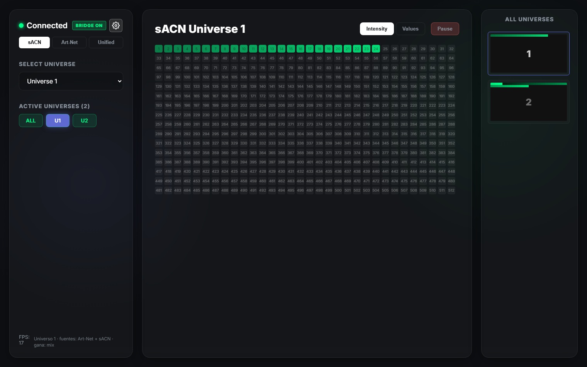
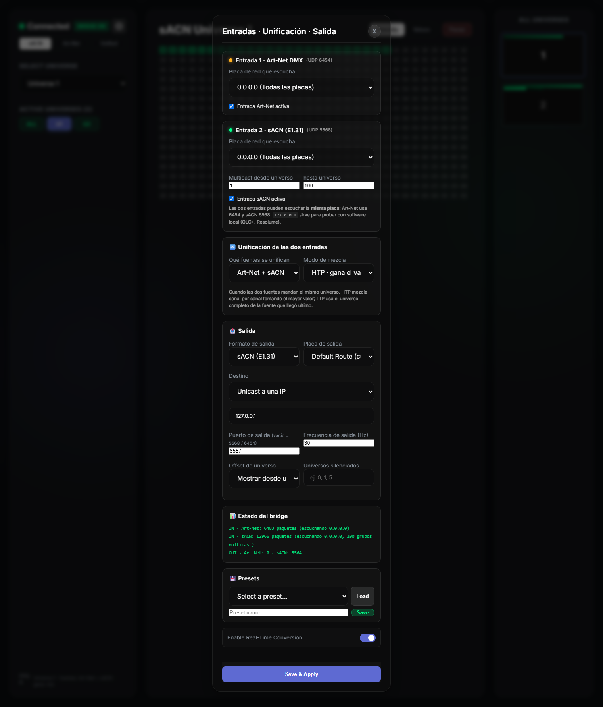
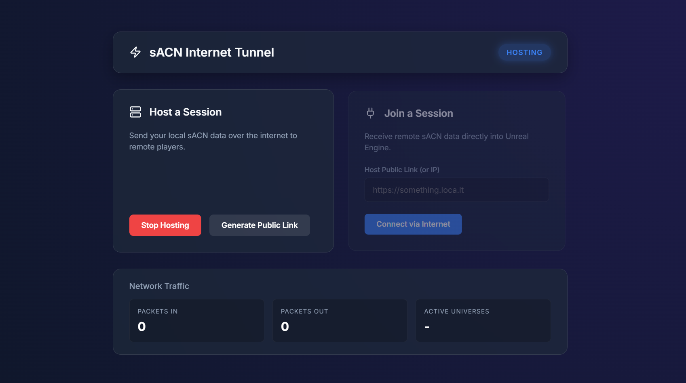

# DMX & sACN Web Visualizer / Network Bridge





Visualizador web en tiempo real y **bridge de conversión de protocolos** para DMX512.
Visualiza 96+ universos de Art-Net o sACN en el navegador a 60 FPS (parseo binario + dibujo por GPU)
y funciona como **puente entre dos entradas y dos formatos de salida**.

> **Novedad v2.0** — Dos entradas simultáneas (Art-Net **y** sACN, cada una en la placa de red que elijas),
> unificación de ambas (HTP/LTP) y salida elegible en **sACN o Art-Net**, con placa, destino y frecuencia configurables.

---

## 🚀 Features

### Entradas (las dos a la vez)
- **Entrada Art-Net DMX** (UDP `6454`) con **selección de placa de red** — `0.0.0.0` (todas), una IP concreta o `127.0.0.1`.
- **Entrada sACN E1.31** (UDP `5568`) con **su propia selección de placa** + **unión a los grupos multicast** de un rango de universos configurable (recibe multicast *y* unicast).
- Las dos entradas pueden escuchar **la misma placa al mismo tiempo**: usan puertos distintos.
- Cada entrada se puede activar/desactivar por separado.

### Unificación
- **Qué fuentes se mezclan**: las dos, sólo Art-Net o sólo sACN.
- **Modo de mezcla**:
  - **HTP** (por defecto) — canal por canal gana el valor más alto.
  - **LTP** — gana el universo completo de la fuente que llegó último.
- El visor muestra qué fuentes alimentan cada universo y quién está ganando.

### Salida
- **Formato elegible: sACN o Art-Net DMX** (se arma el paquete ArtDmx completo, no sólo se reenvía).
- **Placa de salida** seleccionable (útil para VPN tipo ZeroTier/Tailscale).
- **Destino**: Multicast `239.255.x.y` (calculado por universo, recomendado en sACN) · Unicast a una IP · Broadcast `255.255.255.255` (clásico de Art-Net).
- **Puerto y frecuencia** de salida configurables (por defecto 5568 / 6454 y 30 Hz).
- Offset de numeración de universo y **universos silenciados** (para no duplicar salidas de fuentes mezcladas).

### Visualizador y panel
- Grilla completa de 512 canales por universo, minimap de todos los universos, modo "Values" (0-255), pausa de render.
- **Tercera vista "Unified"**: exactamente lo que está saliendo del bridge.
- Panel con **estado del bridge**: paquetes recibidos/enviados por protocolo, placas en uso, grupos multicast unidos y último error de envío.
- **Presets** que guardan la configuración completa (incluidas las dos entradas y la salida).
- **sACN Internet Tunnel** (`tunnel/`) para mandar luces a un colaborador remoto sin VPN (WebSockets + localtunnel).

### Tests y herramientas
- `npm test` — 18 tests (unitarios del codec + **integración UDP real**: Art-Net y sACN entran juntos, se unifican y salen en ambos formatos).
- `node tools/demo_traffic.js` — genera tráfico Art-Net **y** sACN a la vez para probar el bridge sin consola de luces.
- **API REST** para automatizar: `GET/POST /api/config`, `GET /api/stats`, `POST /api/reset-stats`.

---

## 🛠️ Instalación

### Opción A — Portable (NO hace falta instalar Node.js)
Copiá la carpeta entera a la PC que quieras (no necesita internet) y **doble clic en `start_server.bat`**.
El runtime de Node y las dependencias viajan dentro de la carpeta (`runtime\` y `node_modules\`),
así que no se instala ni se modifica nada del sistema.

- Si falta el runtime: `install.bat` lo descarga dentro de la propia carpeta (no instala nada en Windows).
- Único requisito: el **puerto 3000 libre** y dar permiso de red si Windows/antivirus lo pide.
- Para armar el `.zip` portable: `python tools\build_portable.py` → genera en `dist\` los paquetes listos para copiar.

### Opción B — Con Node.js instalado (desarrollo)
1. **[Node.js](https://nodejs.org/en/download) (v16 o superior)**.
2. Descomprimí la carpeta del proyecto (no lo ejecutes desde dentro del ZIP/RAR).
3. Doble clic en `install.bat` → instala `express` y `socket.io`. Esperá el `[+] Installation Complete!`.

---

## 🏃 Uso

### 1. Arrancar
Doble clic en `start_server.bat` → abre `http://localhost:3000/`.
*Dejá abierta la ventana negra "DMX Backend Server": si la cerrás, se corta la captura de DMX.*

### 2. Visualizar
1. Mandá Art-Net o sACN desde TouchDesigner, Resolume, QLC+, GrandMA, etc.
2. Los universos aparecen solos en la columna izquierda (`U1`, `U42`…). Clic en el pill para ver la grilla completa.
3. Botones **Intensity / Values / Pause** arriba; minimap a la derecha.
4. El toggle **sACN / Art-Net / Unified** cambia la fuente que estás mirando.

### 3. Configurar el bridge
Clic en el engranaje ⚙️ (o entrá directo a `http://localhost:3000/#bridge`):

1. **Entrada 1 · Art-Net DMX** — elegí la placa que escucha (o `0.0.0.0`) y dejala activa.
2. **Entrada 2 · sACN (E1.31)** — elegí su placa (puede ser la misma) y el rango de universos multicast.
3. **Unificación** — qué fuentes se mezclan y con qué criterio (HTP/LTP).
4. **Salida** — formato (sACN o Art-Net), placa de salida, destino (Multicast/Unicast/Broadcast), puerto y frecuencia.
5. Encendé **Enable Real-Time Conversion** y `Save & Apply`. El badge pasa a **BRIDGE ON**.

### 4. Probar sin consola de luces
```bash
node tools/demo_traffic.js --seconds 60
```
Manda Art-Net y sACN simultáneos (universo 1 con valores distintos en cada protocolo, para ver el efecto del HTP/LTP, y universo 2 con un barrido).

### 5. Automatizar por API
```bash
# ver estado
curl http://localhost:3000/api/config
curl http://localhost:3000/api/stats

# activar el bridge con salida Art-Net hacia otra placa
curl -X POST http://localhost:3000/api/config -H "Content-Type: application/json" -d '{
  "enabled": true,
  "artnetIn": { "enabled": true, "interface": "0.0.0.0" },
  "sacnIn":   { "enabled": true, "interface": "0.0.0.0", "multicastFrom": 1, "multicastTo": 100 },
  "merge":    { "policy": "htp", "sources": "both" },
  "out":      { "protocol": "artnet", "interface": "192.168.100.120", "targetMode": "broadcast", "port": 6454, "rate": 30 }
}'
```

### 6. Tunnel (sin VPN)
Ver `tunnel/` — el HOST genera un link `https://…loca.lt` y el JOINER lo pega para recibir las luces re-emitidas como sACN multicast local. (El bridge debe estar en modo **Multicast** para que el tunnel lo intercepte.)

---

## 🧰 Arquitectura

- **Backend (Node.js)**: sockets UDP nativos (`dgram`) — se parsean los `Buffer` crudos por offsets, sin librerías de DMX. El codec y la unificación viven en `lib/dmx.js` (módulo puro y testeable); el servidor en `server.js`.
- **Unificación**: `SourceRegistry` guarda el último buffer por protocolo y universo con marca de tiempo; en cada tick (30 Hz por defecto) se calcula el estado unificado y se emite en el formato de salida elegido.
- **Frontend (HTML/JS/CSS vanilla)**: sin frameworks. Render con `Uint8Array` + diffing y `CanvasRenderingContext2D` para los minimaps (60 FPS con 46.000 canales entrando).

```
lib/dmx.js      codec Art-Net/sACN + merge HTP/LTP + registry
server.js       entradas, unificación, salida, socket.io, API REST
public/         UI (index.html, app.js, style.css, bridge-sections.css)
test/           dmx.test.js (unit) + bridge.e2e.test.js (integración UDP)
tools/          demo_traffic.js (generador de tráfico de prueba)
```

---

## 🌟 Credits

- **Tolch** - [Instagram (@tolch.x)](https://www.instagram.com/tolch.x/)
- **Vj X-Rat** - [Instagram (@vj.xrat)](https://www.instagram.com/vj.xrat/)
